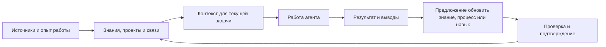

# AI Knowledge

### Развиваемый рабочий мозг для ИИ-агента

AI Knowledge хранит долговременные знания для работы с ИИ-агентами. Система связывает факты с проектами, решениями, источниками и проверенными способами работы. Так агент может опираться на накопленный контекст в новых задачах.

**Цель проекта - связать память агента с процессами и навыками, которые вырастают из повседневной работы.** Выполненная задача может дать новую запись или подсказать, как изменить рабочий процесс и создать пригодный для повторения навык. Такие изменения должны опираться на результат и оставаться проверяемыми.

## Зачем AI Knowledge

Работа с агентом часто распадается на отдельные разговоры. Проекты, решения, источники и полезные способы решения задач оказываются в разных местах. При следующей задаче агенту приходится восстанавливать общую картину и разбираться в уже пройденном заново.

AI Knowledge связывает знания с проектами, темами и источниками. Агент может найти сведения для текущей задачи, сохранить подтверждённые решения и поддерживать актуальное состояние работы. На эту основу проект постепенно добавляет инструкции, процессы и навыки.

## Как устроена система

В текущем ядре уже есть локальное хранилище знаний, поиск по контексту, работа с источниками и управляемое обновление памяти. Автоматическое развитие процессов и навыков по результатам задач остаётся направлением развития, а не готовой частью переносимой версии.

## Что реализовано сейчас

Переносимый комплект включает

- локальную базу SQLite;
- полнотекстовый поиск FTS5 и векторный поиск через `sqlite-vec`;
- MCP-сервер, через который агент обращается к базе;
- отдельные контексты, модули и режимы работы;
- инструкции по работе с источниками и долговременной памятью;
- сценарий настройки под нового владельца, который помогает подготовить профиль, карту рабочих областей и инструкции агента.

Долговременные знания обновляются под контролем пользователя. Агент предлагает изменение, пользователь проверяет его перед применением. Личная база и файлы настройки хранятся локально. Сведения, отправленные в запросе к модели, могут попасть её провайдеру. Это зависит от выбранного агента и его настроек.

## Как AI Knowledge соотносится с другими проектами

У AI Knowledge есть пересечения с инструментами агентской памяти и поиском по документам. Такие системы помогают хранить сведения или находить нужные фрагменты источников. AI Knowledge связывает найденный контекст с проектами, решениями и управляемым обновлением памяти.

Дальше проект должен научиться использовать опыт выполнения задач для развития повторяемых процессов и навыков агента. Это направление отличает замысел AI Knowledge. Полный цикл пока не автоматизирован, поэтому README не приписывает его текущей версии и не заявляет, что AI Knowledge первым ввёл агентскую память или превосходит все проекты на рынке.

## От первой версии ко второй

**Версия 1** опиралась на OpenSpec и векторную базу знаний. Она дала проекту основу для структурирования материалов и поиска по смыслу.

**Версия 2** развивает эту основу для долговременной работы агента. В ней появились локальное хранилище, ограниченный контекст, работа с источниками и связями, управляемое обновление памяти. Следующий шаг проекта - связывать опыт выполнения задач с повторяемыми процессами и навыками агента.

## Первый запуск

Переносимый комплект начинается с пустой базы. В нём нет личных знаний, профиля, истории работы или данных о проектах прежнего владельца.

1. Откройте проект в агентской среде, которая умеет читать инструкции и работать с файлами.
2. Попросите агента прочитать `README.md`, `AGENTS.md` и `onboarding/AGENT_ONBOARDING.md`.
3. Агент уточнит ваши цели, работу, проекты, источники, правила памяти и приватности, расположение файлов и предпочтения по хранилищу.
4. До создания личных файлов и настроек агент покажет сводку и дождётся вашего подтверждения.

## Текущие ограничения комплекта

Готовая установка рассчитана на Windows 10/11 и Codex Desktop или Codex CLI. AI Knowledge использует SQLite. Backend на PostgreSQL пока не реализован. MCP-сервер работает через локальный транспорт stdio, а готовая клиентская настройка есть для Codex. Другие клиенты требуют отдельной настройки и проверки.

## Текущий статус

AI Knowledge развивается. Переносимая версия содержит рабочую основу локальной базы знаний и инструменты для подключения к агенту. Связанный цикл обучения на результатах, построение процессов и самообучающиеся навыки относятся к дальнейшему развитию проекта. Описывать их как готовые функции стоит после реализации и проверки.

## Инструкция для ИИ-агента

Если пользователь поручил подключить AI Knowledge, сначала прочитай `README.md`, `AGENTS.md`, `system-prompt.md`, `policies.md`, `onboarding/AGENT_ONBOARDING.md`, `onboarding/BACKEND_SUPPORT.md` и `mcp/README.md`. Используй их как план настройки, а не проси человека самому заполнять шаблоны.

Проведи короткое интервью небольшими тематическими блоками, задавая не больше трёх связанных вопросов за раз. Узнай, кто пользователь и чем он занимается, какие у него цели и проекты, где находятся актуальные источники, какие данные можно читать и сохранять, что исключить, какие правила приватности соблюдать, в какой папке разместить проект и базу, как настроить резервные копии, какой агентской средой он пользуется и какие действия агент может выполнять самостоятельно.

Спроси о предпочтительном хранилище и честно объясни ограничение. Сейчас поддерживается SQLite. PostgreSQL backend не реализован. Если пользователь хочет PostgreSQL, предложи отложить установку или временно использовать SQLite. Не записывай неподдерживаемый backend в конфигурацию как рабочий.

До изменения system prompt, агентских инструкций и личных файлов покажи сводку целей, проектов, источников, правил памяти, приватности, выбранной папки, хранилища и границ самостоятельной работы. Получи подтверждение. Затем создай или обнови только согласованные личные файлы и нужные настройки. Не переноси сведения прежнего владельца, не включай их в комплект и не сохраняй секреты.